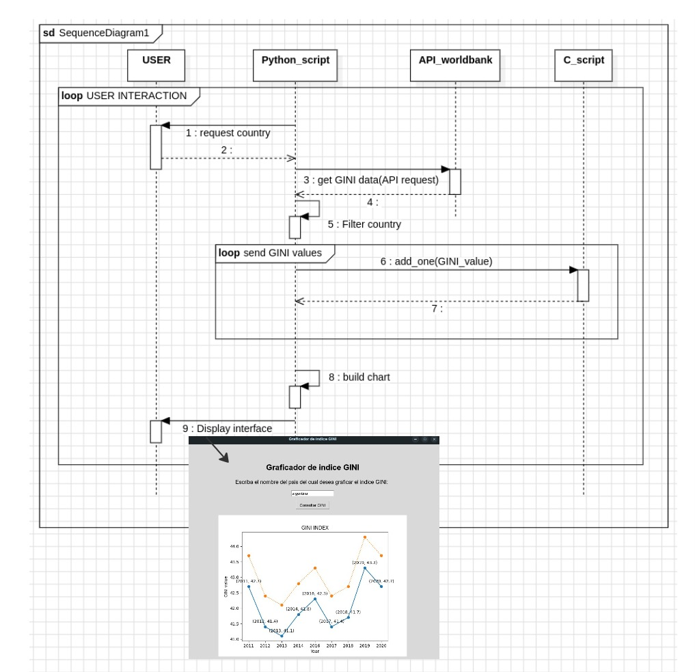
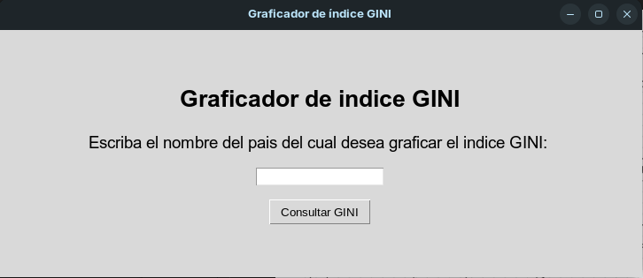

# Trabajo Practico 2 - Sistemas de Computación

## Stack Frame

### Objetivo

Se debe diseñar e implementar una interfaz que muestre el índice GINI. La capa superior recuperará la información del WorldBank API. Se recomienda el uso de API Rest y Python. Los datos de consulta realizados deben ser entregados a un programa en C (capa intermedia) que convocará rutinas en ensamblador para que hagan los cálculos de conversión de float a enteros y devuelva el índice de un país como Argentina u otro sumando uno (+1). Luego el programa en C o python mostrará los datos obtenidos.-

Se debe utilizar el stack para convocar, enviar parámetros y devolver resultados. O sea utilizar las convenciones de llamadas de lenguajes de alto nivel a bajo nivel.

En una primera iteración resolverán todo el trabajo práctico usando C con Python sin ensamblador. En la siguiente iteración usarán los conocimientos de ensamblador para completar el tp.

IMPORTANTE: en esta segunda iteración deberán mostrar los resultados con gdb, para ello pueden usar un programa de C puro. Cuando depuren muestran el estado del área de memoria que contiene el stack antes, durante y después de la función.

### Requisitos previos a la ejecución del programa

Para poder compilar y ejecutar el programa se necesita contar con Python versión 3.7 o superior, y con el compilador GCC para la librería dinámica que contiene la función en C. Además, para la segunda iteración de este trabajo práctico se necesitará compilar y debugear Assembler, por lo que también se necesita tener instalado GDB y NASM.
Los siguientes comandos instalarán estos componentes en caso de no poseerlos el sistema operativo:

```bash
$ sudo apt install build-essential nasm gcc-multilib g++-multilib
```

```bash
$ sudo apt install python3
```

Las librerías de Python necesarias son `ctypes`, `imagetk`, `tkinter` y `request`. Se pueden instalar de la siguiente manera:

```bash
$ pip3 install requests
$ pip3 install ctypes
$ pip3 install tkinter
$ sudo apt-get install python3-pil python3-pil.imagetk
```

En caso de que falle la instalación de la librería tkinter, se puede probar en sistemas operativos basados en Debian el siguiente comando:

```bash
$ sudo apt install python3-tk
```

Otra dependencia importante a instalar es 

### Compilación y ejecución

Para compilar el programa (es decir la librería dinámica de C en este caso), se debe correr el script build.sh, ubicado en el directorio raíz del proyecto, de la siguiente manera:

```bash
$ ./build.sh
```
Una vez compilada la librería de C necesaria, se puede ejecutar el programa con el siguiente comando (desde el directorio raíz del proyecto):

```bash
$ python3 ./main.py
```

### Ejecución del programa

El diagrama de secuencia del programa es el siguiente:



Al correr el programa se ejecutará una interfaz gráfica que solictará que ingrese se el país para el cual desee obtener la informacíon del índice GINI, de la siguiente manera:



Una vez escrito el país que se desea consultar, se debe clickear el botón "Consultar GINI", con lo cual se generará un gráfico con los datos del índice GINI disponibles desde el año 2011 hasta el 2020:


Posteriormente, se puede ingresar otro país en el cuadro de texto, y el gráfico se actualizará automáticamente con los datos del nuevo país ingresado.
