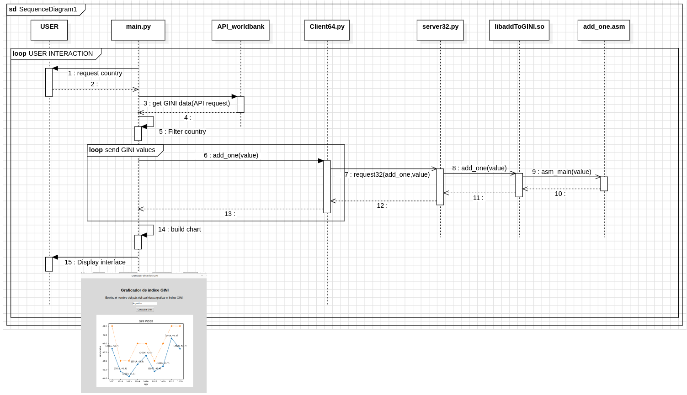
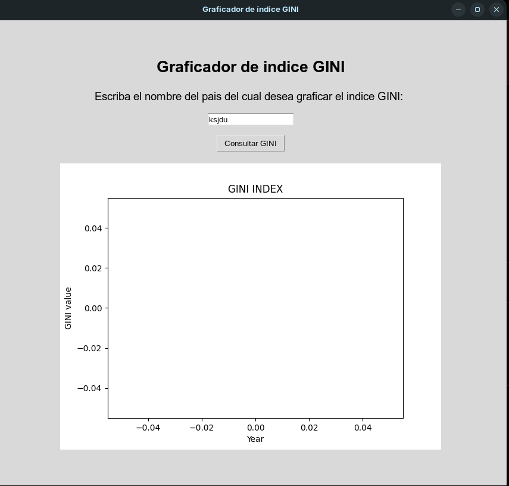
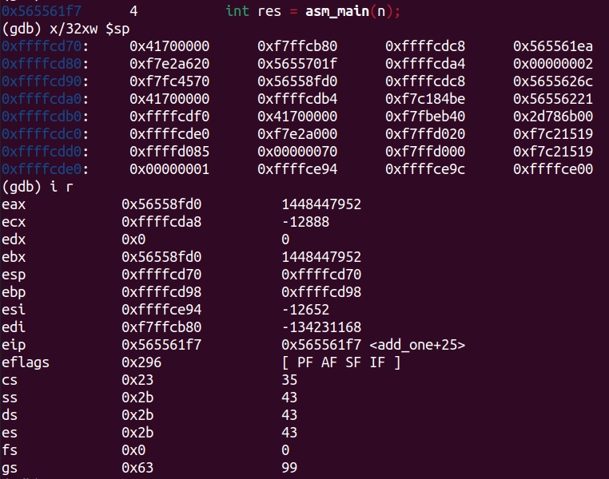
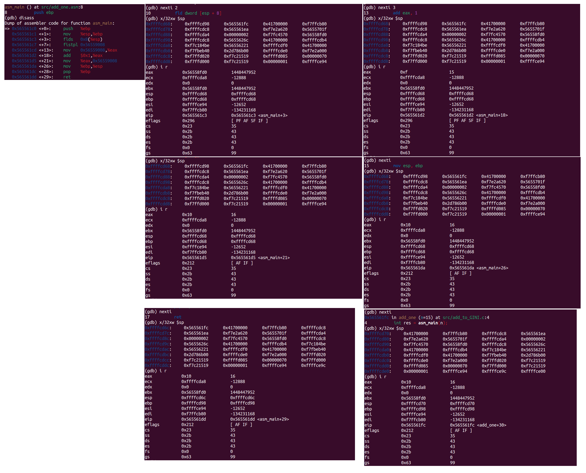
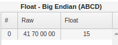

# Trabajo Practico 2 - Sistemas de Computación

## Stack Frame

### Objetivo

Se debe diseñar e implementar una interfaz que muestre el índice GINI. La capa superior recuperará la información del WorldBank API. Se recomienda el uso de API Rest y Python. Los datos de consulta realizados deben ser entregados a un programa en C (capa intermedia) que convocará rutinas en ensamblador para que hagan los cálculos de conversión de float a enteros y devuelva el índice de un país como Argentina u otro sumando uno (+1). Luego el programa en C o python mostrará los datos obtenidos.-

Se debe utilizar el stack para convocar, enviar parámetros y devolver resultados. O sea utilizar las convenciones de llamadas de lenguajes de alto nivel a bajo nivel.

En una primera iteración resolverán todo el trabajo práctico usando C con Python sin ensamblador. En la siguiente iteración usarán los conocimientos de ensamblador para completar el tp lo cual ya se encuentra implementado.

IMPORTANTE: en esta segunda iteración deberán mostrar los resultados con gdb, para ello pueden usar un programa de C puro. Cuando depuren muestran el estado del área de memoria que contiene el stack antes, durante y después de la función.

### Sobre las API REST

Una API de REST, o API de RESTful, es una interfaz de programación de aplicaciones (API o API web) que se ajusta a los límites de la arquitectura REST y permite la interacción con los servicios web de RESTful. El informático Roy Fielding es el creador de la transferencia de estado representacional (REST).

Las API son conjuntos de definiciones y protocolos que se utilizan para diseñar e integrar el software de las aplicaciones.Suele considerarse como el contrato entre el proveedor de información y el usuario, donde se establece el contenido que se necesita por parte del consumidor (la llamada) y el que requiere el productor (la respuesta).Por ejemplo, el diseño de una API de servicio meteorológico podría requerir que el usuario escribiera un código postal y que el productor diera una respuesta en dos partes: la primera sería la temperatura máxima y la segunda, la mínima.

En otras palabras, las API le permiten interactuar con una computadora o un sistema para obtener datos o ejecutar una función, de manera que el sistema comprenda la solicitud y la cumpla.


### Requisitos previos a la ejecución del programa

Para poder compilar y ejecutar el programa se necesita contar con Python versión 3.7 o superior, y con el compilador GCC para la librería dinámica que contiene la función en C. Además, para la segunda iteración de este trabajo práctico se necesitará compilar y debugear Assembler, por lo que también se necesita tener instalado GDB y NASM.
Los siguientes comandos instalarán estos componentes en caso de no poseerlos el sistema operativo:

```bash
$ sudo apt install build-essential nasm gcc-multilib g++-multilib
```

```bash
$ sudo apt install python3
```

Las librerías de Python necesarias son `ctypes`, `imagetk`, `tkinter`, `request` y `msl-loadlib`. Se pueden instalar de la siguiente manera:

```bash
$ pip3 install requests
$ pip3 install tkinter
$ pip3 install matplotlib
$ pip3 install msl-loadlib
$ sudo apt install python3-tk
$ sudo apt-get install python3-pil python3-pil.imagetk
```
### Compilación y ejecución

Para compilar el programa (es decir la librería dinámica de C en este caso), se debe correr el script build.sh, ubicado en el directorio raíz del proyecto, de la siguiente manera:

```bash
$ ./build.sh
```
Una vez compilada la librería de C necesaria, se puede ejecutar el programa con el siguiente comando (desde el directorio raíz del proyecto):

```bash
$ python3 ./src/main.py
```

### Ejecución del programa

El diagrama de secuencia del programa es el siguiente:



Al correr el programa se ejecutará una interfaz gráfica que solictará que ingrese se el país para el cual desee obtener la informacíon del índice GINI, de la siguiente manera:


Una vez escrito el país que se desea consultar, se debe clickear el botón "Consultar GINI", con lo cual se generará un gráfico con los datos del índice GINI disponibles desde el año 2011 hasta el 2020:


Posteriormente, se puede ingresar otro país en el cuadro de texto, y el gráfico se actualizará automáticamente con los datos del nuevo país ingresado.

En este recuadro se pueden ver dos gráficos superpuestos. La línea azul corresponde a los datos originales obtenidos de la API, es decir datos de tipo float, y la línea anaranjada corresponde al resultado del procesamiento de los datos por la función en lenguaje C, que en este caso devuelve el valor de GINI + 1, convertido a un entero.

En caso de que se ingrese un país del cual no se tienen datos o una cadena de texto inválida elgráfico quedará en blanco, indicando la falta de datos GINI para ese país ingresado o cadena inválida.



### Segunda iteración, implementación de función en assembler
Para esta segunda iteración se implementó un ligero cambio. La función encargada de sumar 1 a cada valor de índice GINI se codificó esta vez en lenguaje assembler, con el objetivo de analizar el comportamiento del stack frame y algunos registros del procesador frente a los llamados entre funciones de distintos lenguajes (para nuestro caso entre lenguaje C y assembler). Este análisis se realizó compilando ambos códigos con información de depuración, para realizar un análisis posterior utilizando GDB.

### Código assembly

```assembly
    section .data                       ; para los datos
        num dd 0                        ; 4 bytes inicializados en 0

    global asm_main                     ; define a la funcion como global para poder accederla
    section .text                       ; seccion de codigo     

    asm_main:
        push ebp                        ; guarda valor en la pila
        mov ebp, esp                    ; ebp = esp
        fld dword [esp + 8]             ; carga el param [esp+8] de punto flotante de 32 bits (dword) 
        fistp dword[num]                ; convierte el valor de punto flotante a entero
        mov eax, [num]                  ; eax = num
        add eax, 1                      ; eax + 1
        mov [num], eax                  ; num = eax
        mov esp, ebp                    ; esp = ebp
        pop ebp                         ; Limpia la pila
        ret                             ; retorno de la funcion
```

### Depuración del programa
Se realizó un nuevo script de bash para compilar nuestro programa con información de depuración. Para poder hacer la depuracion utilizando GDB (compatible con C y Assembler pero no con Python) se realizó un programa "main.c" sencillo que pide por terminal un valor de índice GINI, para enviarlo luego a la función en Assembler para que lo procese (le sume uno y lo trunque a un valor entero). En resumen, para realizar la depuración, nos abstraímos del código de Python, quedándonos únicamente con código C y Assembler.

Primero se debe ejecutar el script para realizar el build con información de debuging, de la siguiente manera:

```bash
$ ./build_gdb.sh
```

Esto generará un archivo "result" en la carpeta build. Con esto se puede ejecutar gdb para debugear el programa:

```bash
    gdb ./build/result
    (gdb) break main.c:11
    (gdb) break add_to_GINI.c:4
    (gdb) run
```

Con estos comandos se definen distintos breaks en la ejecución, definidos en las llamadas a funciones, que son los puntos críticos en los cuales nos interesa analizar el stack y los registros.

Para llamar a nuestro codigo .asm se definió una funcion externa dentro del código en C:

```c
extern int asm_main(float);
```

#### add_to_GINI.c:4 int res = asm_main(n) realiza la llamada al codigo .asm



Como se ve en la imagen, previo a la ejecución de la función assembler, el registro eax contiene un valor desconocido para nosotros, además de que como es de esperar, esp y ebp apuntan a direcciones de memoria distintas. A lo largo de la ejcución de la función assembler veremos como en un primer momento el ebp se iguala al esp, y luego como el esp comienza a decrementar las direcciones de memoria a las que apunta, debido al crecimiento del stack por el llamado a la función.

#### add_one.asm



En las imágenes previas podemos ver las capturas de los registros en distintos momentos de la ejecución de la función add_one.asm, como así también luego del retorno de esta.

El comando x/32xw nos muestra 32 posiciones de memoria a partir del valor de ESP, mientras que el comando info registers (i r) muestra los valores de todos los registros del procesador en ese momento de la ejecución. Proporciona información sobre los registros generales (eax, ebx, etc.), así como los registros de segmento, los registros de estado (eflags) y valor del puntero de instrucción (eip) y el puntero de pila (esp y ebp).

#### Análisis

- Al entrar en el bloque de ejecucion asm_main:
    - El registro esp es distinto ebp.
    - Si observamos esp antes de la llamada es 0xffffcd70, al entrar decrementó en 2 (0xffffcd68), lo que significa que a pusheado 8 bytes, debido a que se esta analizando un arq de 32 bits.
- Al avanzar, se ejecuta el push del ebp y el mov para actualizarlo:
    - Se Guarda el valor del ebp en la pila.
    - El registro ebp se iguala al esp.
- Luego se carga el valor pasado por parametro (en el ejemplo de ejecución en 15):
    - Se actualiza el registro eax = 15
    - Se puede observar que el parámetro que nos interesa se encuentra en [esp+8], que contiene el valor 0x41700000, que si tenemos en cuenta que se trata de un valor de punto flotante, esto equivale al número 15. Esto es así ya que esp apunta a los datos de la función (en este caso la variable num que definimos en Assembler), por lo tanto en esp+4 se tiene la dirección de retorno, y en esp+8 los parámetros que recibe la función, en este caso el índice GINI que se le pasó. Es por eso que el valor del parámetro contenido en esta posición de memoria se carga en la variable num, para luego ser operado en el registro eax.

    
- Se convierte a entero y se le suma uno:
    - el registro de propósito general ahora es eax = 16
- Al salir de la funcion:
    - Se limpia la pila, en nuestro caso no hay variables locales.
- Al realizar el return:
    - Vemos que el esp apunta al valor de la direccion de retorno.
    - Observamos que ahora la pila tiene la misma longitud que antes de entrar a la llamada, por lo tanto esp vuelve a incrementar hacia la posición 0xffffcd70.

### Programa final
Para la versión final del programa, buscando mantener la GUI de Python y también el código en Assembler, utilizamos la librería msl-loadlib, con el objetivo de compatibilziar la función de assembler (compilada para una arquitectura i386 de 32 bits) con el código Python (arquitectura x86 de 64 bits). Esta librería se encarga de compatibilizar ambas arquitecturas utilizando la comunicación entre procesos a través del Sistema operativo (utiliza una arquitectura de cliente servidor local, donde el cliente solicita la función de assembler, para que el servidor la compatibilice con los 64 bits y se la entregue). Gracias a esto conseguimos que el programa final se mantenga en funcionamiento a pesar de las diferencias de funcionamiento internas de cada código particular. A la vista del usuario el funcionamiento es el mismo que en la primera iteración, pero el funcionamiento interno ahora incluye el pequeño algoritmo en Assembler analizado anteriormente.
