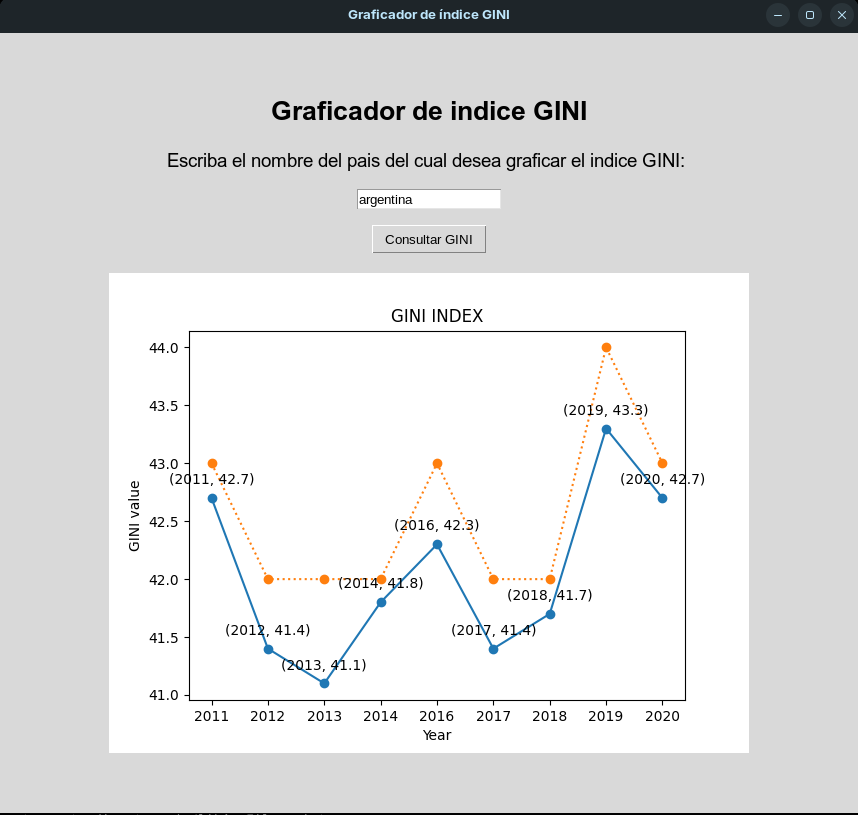

# Trabajo Practico 2 - Sistemas de Computación

## Stack Frame

### Objetivo

Se debe diseñar e implementar una interfaz que muestre el índice GINI. La capa superior recuperará la información del WorldBank API. Se recomienda el uso de API Rest y Python. Los datos de consulta realizados deben ser entregados a un programa en C (capa intermedia) que convocará rutinas en ensamblador para que hagan los cálculos de conversión de float a enteros y devuelva el índice de un país como Argentina u otro sumando uno (+1). Luego el programa en C o python mostrará los datos obtenidos.-

Se debe utilizar el stack para convocar, enviar parámetros y devolver resultados. O sea utilizar las convenciones de llamadas de lenguajes de alto nivel a bajo nivel.

En una primera iteración resolverán todo el trabajo práctico usando C con Python sin ensamblador. En la siguiente iteración usarán los conocimientos de ensamblador para completar el tp lo cual ya se encuentra implementado.

IMPORTANTE: en esta segunda iteración deberán mostrar los resultados con gdb, para ello pueden usar un programa de C puro. Cuando depuren muestran el estado del área de memoria que contiene el stack antes, durante y después de la función.

### Sobre las API REST

Una API de REST, o API de RESTful, es una interfaz de programación de aplicaciones (API o API web) que se ajusta a los límites de la arquitectura REST y permite la interacción con los servicios web de RESTful. El informático Roy Fielding es el creador de la transferencia de estado representacional (REST).

Las API son conjuntos de definiciones y protocolos que se utilizan para diseñar e integrar el software de las aplicaciones.Suele considerarse como el contrato entre el proveedor de información y el usuario, donde se establece el contenido que se necesita por parte del consumidor (la llamada) y el que requiere el productor (la respuesta).Por ejemplo, el diseño de una API de servicio meteorológico podría requerir que el usuario escribiera un código postal y que el productor diera una respuesta en dos partes: la primera sería la temperatura máxima y la segunda, la mínima.

En otras palabras, las API le permiten interactuar con una computadora o un sistema para obtener datos o ejecutar una función, de manera que el sistema comprenda la solicitud y la cumpla.


### Requisitos previos a la ejecución del programa

Para poder compilar y ejecutar el programa se necesita contar con Python versión 3.7 o superior, y con el compilador GCC para la librería dinámica que contiene la función en C. Además, para la segunda iteración de este trabajo práctico se necesitará compilar y debugear Assembler, por lo que también se necesita tener instalado GDB y NASM.
Los siguientes comandos instalarán estos componentes en caso de no poseerlos el sistema operativo:

```bash
$ sudo apt install build-essential nasm gcc-multilib g++-multilib
```

```bash
$ sudo apt install python3
```

Las librerías de Python necesarias son `ctypes`, `imagetk`, `tkinter` y `request`. Se pueden instalar de la siguiente manera:

```bash
$ pip3 install requests
$ pip3 install tkinter
$ pip3 install matplotlib
$ sudo apt install python3-tk
$ sudo apt-get install python3-pil python3-pil.imagetk
```
### Compilación y ejecución

Para compilar el programa (es decir la librería dinámica de C en este caso), se debe correr el script build.sh, ubicado en el directorio raíz del proyecto, de la siguiente manera:

```bash
$ ./build.sh
```
Una vez compilada la librería de C necesaria, se puede ejecutar el programa con el siguiente comando (desde el directorio raíz del proyecto):

```bash
$ python3 ./main.py
```

### Ejecución del programa

El diagrama de secuencia del programa es el siguiente:


Al correr el programa se ejecutará una interfaz gráfica que solictará que ingrese se el país para el cual desee obtener la informacíon del índice GINI, de la siguiente manera:


Una vez escrito el país que se desea consultar, se debe clickear el botón "Consultar GINI", con lo cual se generará un gráfico con los datos del índice GINI disponibles desde el año 2011 hasta el 2020:



Posteriormente, se puede ingresar otro país en el cuadro de texto, y el gráfico se actualizará automáticamente con los datos del nuevo país ingresado.

En este recuadro se pueden ver dos gráficos superpuestos. La línea azul corresponde a los datos originales obtenidos de la API, es decir datos de tipo float, y la línea anaranjada corresponde al resultado del procesamiento de los datos por la función en lenguaje C, que en este caso devuelve el valor de GINI + 1, convertido a un entero.

En caso de que se ingrese un país del cual no se tienen datos o una cadena de texto inválida elgráfico quedará en blanco, indicando la falta de datos GINI para ese país ingresado o cadena inválida.


### Implementación de código assembler y depuración del programa
Se realizó un script de bash para compilar nuestro programa con flag de compilacion, para hacer la depuracion se realizo un programa main en c que ejecutará la funcion en c y la implementacion en assembly.

script para realizar el build:
```bash
$ ./build_gdb.sh
```
codigo assembly:
```assembly
    section .data                       ; para los datos
        num dd 0                        ; 4 bytes inicializados en 0

    global asm_main                     ; define a la funcion como global para poder accederla
    section .text                       ; seccion de codigo     

    asm_main:
        push ebp                        ; guarda valor en la pila
        mov ebp, esp                    ; ebp = esp
        fld dword [esp + 8]             ; carga el param [esp+8] de punto flotante de 32 bits (dword) 
        fistp dword[num]                ; convierte el valor de punto flotante a entero
        mov eax, [num]                  ; eax = num
        add eax, 1                      ; eax + 1
        mov [num], eax                  ; num = eax
        mov esp, ebp                    ; esp = ebp
        pop ebp                         ; Limpia la pila
        ret                             ; retorno de la funcion
```

Se ejecutará gdb:
```bash
    gdb ./build/result
    (gdb) break main.c:11
    (gdb) break add_to_GINI.c:4
    (gdb) run
```
Los break estan definidos en las llamadas a funciones .

Para llamar a nuestro codigo .asm se definió una funcion externa:
```c
extern int asm_main(float);
```
#### add_to_GINI.c:4 int res = asm_main(n) realiza la llamada al codigo .asm

#### add_one.asm

El comando info registers (i r)muestra los valores de todos los registros en ese momento de la ejecución. Proporciona información sobre los registros generales (eax, ebx, etc.), así como los registros de segmento, los registros de estado (eflags) y valor del puntero de instrucción (eip) y el puntero de pila (esp y ebp).

#### Analisis
- Al entrar en el bloque de ejecucion asm_main:
    - El registro esp es distinto ebp.
    - Si observamos esp antes de la llamada es 0xffffcd70, al entrar decrementó en 2 0xffffcd68, lo que significa que a pusheado 8 bytes, debido a que se esta analizando un arq de 32 bits.
- al avanzar ejecutar el push del ebp y el mov para actualizarlo:
    - Guardo valor del ebp en la pila.
    - El registro ebp es igual al esp.
- Luego se carga el valor pasado por parametro:
    - Se actualiza el registro eax = 15
    - Podemos observar que el parametro se encuentra en [ebx+8] = 0x41700000 con lo cual si pasamos este exa a float conseguimos 15.

    
- Se convierte a entero y se le suma uno:
    - el registri de proposito general ahora es eax = 16
- Al salir de la funcion:
    - Limpia la pila, en nuestro caso no hay variables locales.
- Al realizar el return:
    - Vemos que el esp apunta al valor de la direccion de retorno.
    - Observamos que ahora la pila tiene la misma longitud que antes de entrar a la llamada.